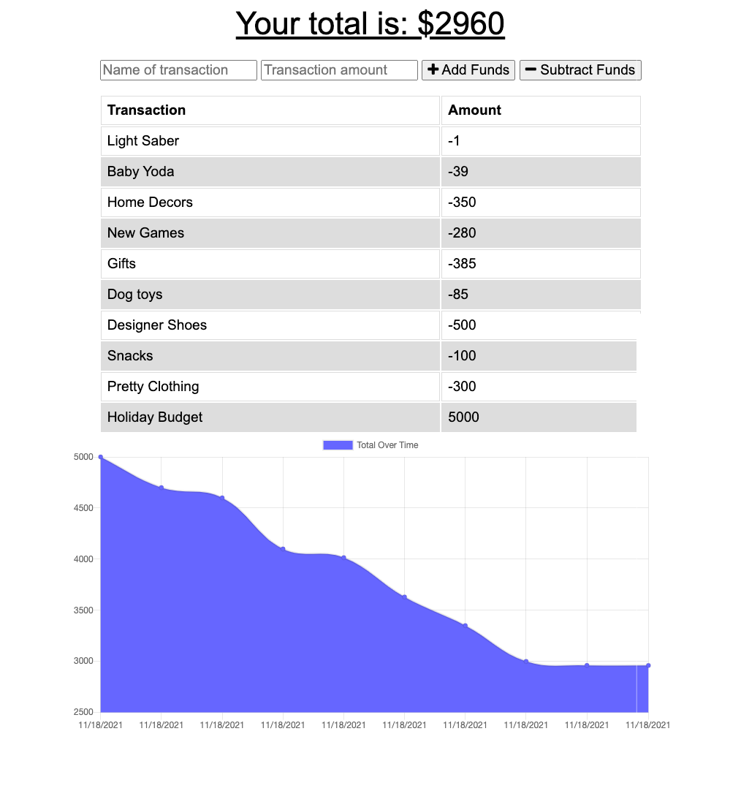

# Budget Tracker 📓 ✏️

This is a budget management application to track the user's withdrawals and deposits with or without a data/internet connection. 

## Table of Contents

- [Description](#description)
- [Screenshot for Demo](#screenshot-for-demo)
- [Heroku Application Link](#heroku-application-link)
- [Questions](#questions)

## Description 

Giving users a fast and easy way to track their money is important, but allowing them to access that information anytime is even more important. Having offline functionality is paramount to the applications success.

Offline Functionality:
- Enter deposits offline
- Enter expenses offline

When brought back online:
- Offline entries should be added to tracker.

## Screenshot for Demo

## Heroku Application Link
- [Link for Heroku Deployment ](https://budget-tracker-elenal.herokuapp.com/)

## Questions
- For more projects, please visit my [GitHub](https://github.com/elenaliu0415). 
- Please feel free to contact me at elenaliu0415@gmail.com
